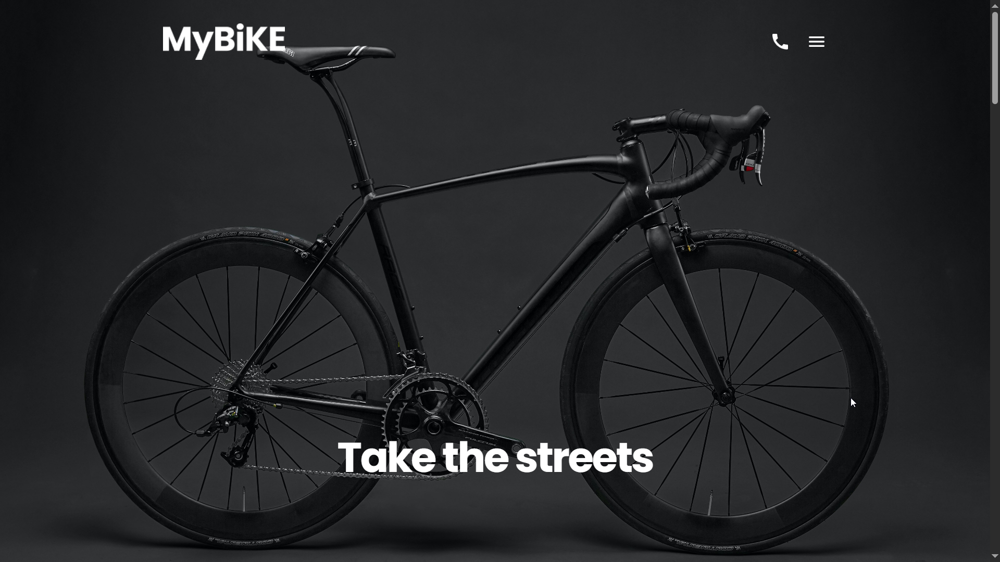

<!-- TABLE OF CONTENTS -->

  
Table of Contents

  <ol>
    <li>
      <a href="#about-the-project">About The Project</a>
      <ul>
        <li><a href="#built-with">Built With</a></li>
      </ul>
    </li>
    <li>
      <a href="#getting-started">Live Demo</a>
    </li>
    <li><a href="#usage">Usage</a></li>
    <li><a href="#roadmap">Roadmap</a></li>
    <li><a href="#contributing">Contributing</a></li>
    <li><a href="#license">License</a></li>
    <li><a href="#contact">Contact</a></li>
    <li><a href="#acknowledgments">Acknowledgments</a></li>
  </ol>

<!-- ABOUT THE PROJECT -->
## About The Project!

# Bicycle Landing Page 🚴

A modern, responsive landing page for a bicycle store or brand. This project showcases a clean and attractive layout designed to promote bicycles, highlight features, and encourage users to explore or make a purchase.

(<a href="#readme-top">back to top</a>)

### 🛠️ Technologies Used

HTML, CSS / SCSS

JavaScript

Responsive design techniques (Flexbox, Grid)

(<a href="#readme-top">back to top</a>)

<!-- GETTING STARTED -->
## Live Demo

link to the preview  - [Landing Page](https://romkaqb.github.io/Landing-Page/)

Link to the original mockup [Original Mockup](https://www.figma.com/design/NZQAIydtHo5QkINyGLHNcq/BIKE-New-Version?node-id=0-1&p=f)

(<a href="#readme-top">back to top</a>)

<!-- USAGE EXAMPLES -->
## Usage 📦
Feel free to use this template for your own bicycle business, personal project, or as a front-end learning resource. You can customize colors, content, and structure to match your brand.

(<a href="#readme-top">back to top</a>)

<!-- LICENSE -->
## License

Distributed under the Unlicense License. See `LICENSE.txt` for more information.

(<a href="#readme-top">back to top</a>)

<!-- CONTACT -->
## Contact

Roman Rusin rgromkorusin12@gmail.com

Project Link: [https://github.com/romkaqb/Landing-Page](https://github.com/romkaqb/Landing-Page)

(<a href="#readme-top">back to top</a>)

